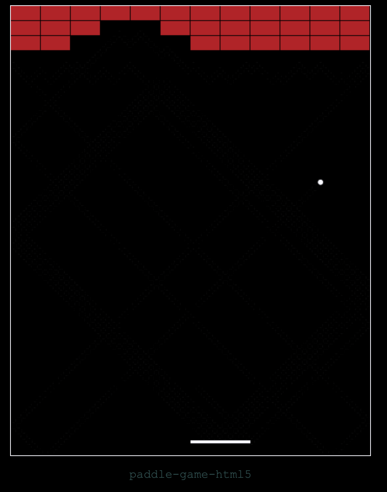

# paddle-game-html5
A paddle game in the style of [Breakout](https://en.wikipedia.org/wiki/Breakout_\(video_game\)) or [Arkanoid](https://en.wikipedia.org/wiki/Arkanoid). Uses vanilla JavaScript and runs on a web browser inside of an HTML5 Canvas element.



## Technology Stack
JavaScript, HTML5 Canvas element

## Install and Run
```bash
# 1. Clone this repository
git clone https://github.com/mes32/paddle-game-html5.git

# 2. To start open the index file with a web browser
open paddle-game-html5/project/index.html

# 3. Select the browser window with mouse

# 4. Move the paddle with left and right arrow keys
```

## Features

### Completed Features
- [x] Display a ball bouncing on a Canvas element
- [x] Listen for keyboard inputs
- [x] Players may move the paddle left to right confined within game screen
- [x] Bricks interact with the ball causing it to bounce and getting knocked out when hit
- [x] Implement a basic gameplay loop: 1. Process inputs, 2. Update game state, 3. Render sprites on game screen

### Planned Features
- [ ] Allow the player to serve the ball
- [ ] Allow the ball to leave the playing field from the bottom edge
- [ ] Scoring metrics that track number of bricks hit and number of balls used
- [ ] Track the ball position with higher precision and down-sample to pixel space
- [ ] Model the physics of the ball bouncing in a more sophisticated manner
- [ ] Have the paddle affect the ball's trajectory somewhat depending on where on the paddle the ball hits 
- [ ] Progression of different game levels

## Author
Mike Stockman